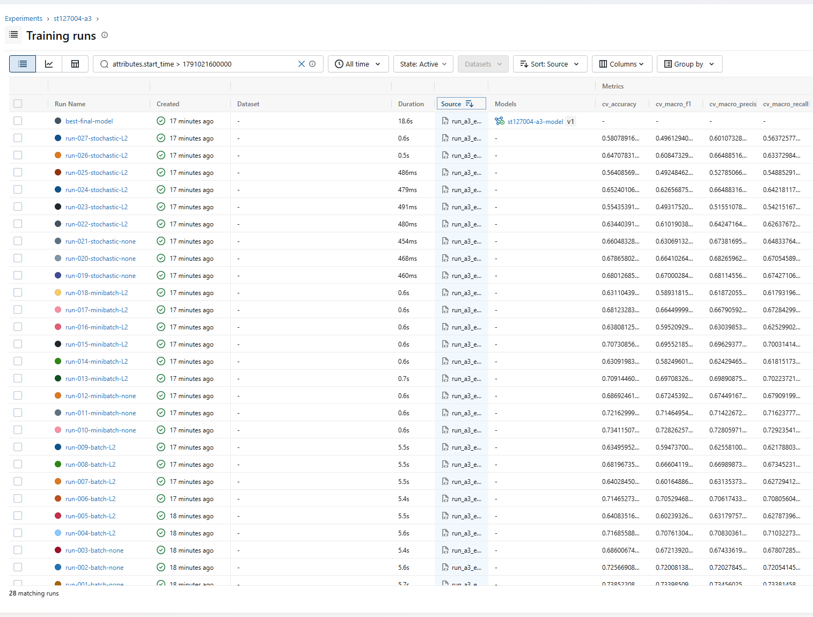
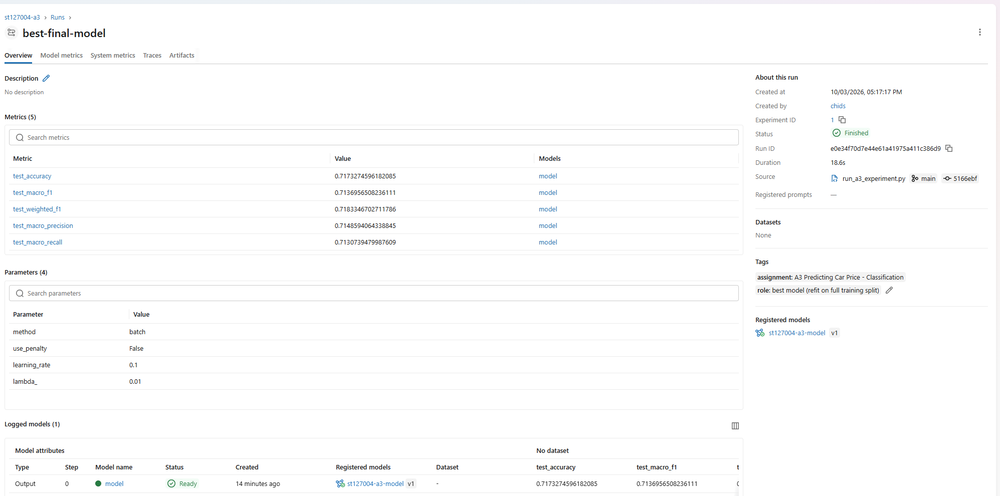
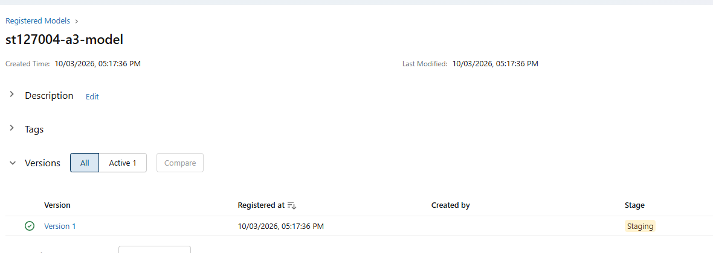
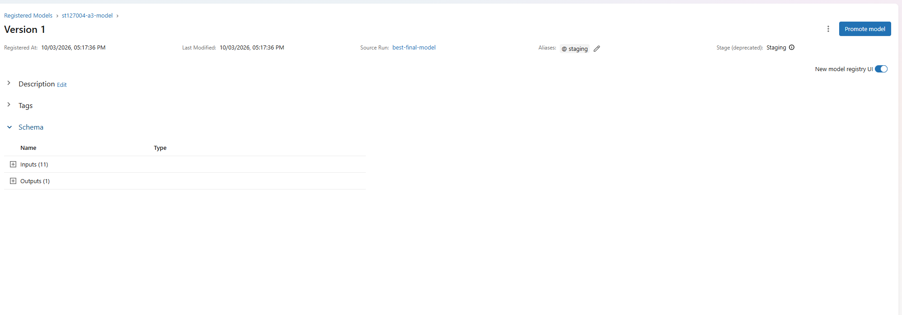

# Assignment 3 — Predicting Car Price (Classification)

**Course:** AT82.03 Machine Learning
**Student:** Chidsanuphong Pengchai — `st127004`

Assignment 3 reuses the A1/A2 car-price dataset but treats it as a **4-class classification**
problem. It implements **multinomial logistic regression from scratch** (based on the class
notebook *02 - Multinomial Logistic Regression*), hand-codes every classification metric, adds an
optional **Ridge (L2) penalty**, runs an **MLflow** experiment, and ships a Dockerised **Streamlit**
app with a **GitHub Actions CI/CD** pipeline.

## Live deployment

| | |
|---|---|
| **App URL** | **https://web-st127004-a3.ml.brain.cs.ait.ac.th** |
| **GitHub** | https://github.com/pcismyname/Assignment-3-car-price |
| Server | `ml-brain.cs.ait.ac.th` · Docker · Traefik reverse proxy · Let's Encrypt TLS |

A3 runs on its **own** subdomain/container (`web-st127004-a3`) so it lives alongside the A2 app
without replacing it. The app predicts a car's **price category** (Budget / Mid-range / Premium /
Luxury) with its rupee range and the model's confidence.

---

## MLflow (Objectives 1 & 2) — local, per the TA's updated grading

Because the course MLflow server is unstable, the TA changed the grading: logging to the course
server is **no longer required**; instead the submission includes **screenshots of the MLflow
experiment runs and the best model**, logged to a **local** MLflow instance as in A2.

- **Objective 1:** experiment **`st127004-a3`** logged to the local store `sqlite:///mlflow.db`
  (params + metrics only — the dataset is **not** logged). The best configuration is refit and
  **saved as an MLflow pyfunc model** in the run `best-final-model`.
- **Objective 2:** that model is registered as **`st127004-a3-model`** (version 1) and moved to
  **Staging** (`run_a3_experiment.py` → `a3_experiment.log_and_register_best_model`).

| Screenshot | Shows |
|---|---|
|  | All 27 sweep runs + `best-final-model` with their CV/test metrics |
|  | Best run: params, test metrics, logged model, registered as `st127004-a3-model v1` |
|  | Model registry: `st127004-a3-model` **Version 1 → Stage: Staging** |
|  | Registered model version detail |

(The optional course-server route was not used.)

---

## Task completion

| Task | Status |
|---|---|
| **Task 1** — bucket price into 4 classes (`pd.qcut`); from-scratch `accuracy`, per-class `precision`/`recall`/`f1`, `macro_*`, `weighted_*`; compare to sklearn; explain *support* | ✅ Complete |
| **Task 2** — optional Ridge (L2) penalty on the logistic loss (on/off + `lambda_`) | ✅ Complete |
| **Task 3 · Obj 1** — MLflow experiment `st127004-a3` logged (local, per TA notice) + model saved | ✅ Complete (screenshots) |
| **Task 3 · Obj 2** — best model registered as `st127004-a3-model` at *Staging* | ✅ Complete (screenshots) |
| **Task 3 · Obj 3** — GitHub Actions CI (unit tests) → CD (build, push, deploy) | ✅ Complete |

---

## Key results

- **Dataset:** 6,808 rows after A1/A2 cleaning, split into 4 **balanced** price quartiles
  (~25% each) with edges (INR): `[30k, 250k, 410k, 640k, 10M]`.
- **Best configuration (full 27-run sweep):** `method=batch`, `use_penalty=False`,
  `learning_rate=0.1`.

| Metric | Value |
|---|---:|
| CV accuracy | 0.7385 |
| CV macro-F1 | 0.7340 |
| **Test accuracy** | **0.7173** |
| Test macro-F1 | 0.7137 |
| Test weighted-F1 | 0.7183 |

The extreme classes (Budget, Luxury) are easiest to separate (F1 ≈ 0.84 / 0.81); the middle bands
overlap more, as expected for price quartiles.

---

## Repository structure

| Path | Purpose |
|---|---|
| `car_price_classification_A3.ipynb` | Executed notebook — Tasks 1–3, all outputs inline |
| `car_price_classification_A3.html` | Rendered notebook for quick viewing / PDF export |
| `logistic_regression.py` | **From-scratch** multinomial logistic regression: softmax, cross-entropy, 3 GD flavours, **Ridge (L2) penalty**, and all metrics |
| `a3_experiment.py` | Cleaning, `pd.qcut` bucketing, preprocessing, stratified CV, MLflow helpers |
| `run_a3_experiment.py` | Reproduces the full 27-run sweep, saves artifacts + the model bundle |
| `Cars.csv` | Course dataset (committed so the notebook and CI are self-contained) |
| `model/a3_car_price_classifier.pkl` | Fitted bundle: preprocessor + classifier + class bin edges |
| `artifacts/` | `cv_results.csv`, `experiment_summary.json`, confusion-matrix & loss figures, MLflow screenshots |
| `mlflow.db` | Local MLflow store — runs, saved model, registry (not committed; regenerate with `run_a3_experiment.py`) |
| `app/` | Dockerised Streamlit app that predicts the price **category** |
| `tests/` | From-scratch model + metric tests (vs scikit-learn) |
| `app/code/tests/` | The two **required** model unit tests (+ extras) |
| `.github/workflows/ci-cd.yml` | CI/CD pipeline |
| `docs/task3_deployment.md` | Deployment record (Traefik, Docker Hub, pull-based updater) |

---

## Reproduce everything

```powershell
python -m pip install -r requirements.txt

# 1) Full experiment + saved model + artifacts
python run_a3_experiment.py

# 2) Run the notebook
jupyter lab car_price_classification_A3.ipynb

# 3) Inspect MLflow runs (experiment: st127004-a3)
mlflow server --backend-store-uri sqlite:///mlflow.db --host 127.0.0.1 --port 5000
```

## Run the tests

```powershell
pytest tests app/code/tests -q
```

The two unit tests required by the assignment are in `app/code/tests/test_predict.py`:
`test_model_takes_expected_input` (the model accepts the expected input) and
`test_model_output_has_expected_shape` (`predict_proba` returns shape `(n, 4)`).

## Run the web app locally

```powershell
cd app
docker compose up --build       # -> http://localhost:8501
```

The app collects a few car details and predicts one of four price bands
(**Budget / Mid-range / Premium / Luxury**) with its rupee range and the model's confidence.

---

## CI/CD (Objective 3)

`.github/workflows/ci-cd.yml`:

1. **CI** — on every push / PR to `main`, install deps and run `pytest tests app/code/tests`.
   ✅ Runs automatically on GitHub-hosted runners.
2. **CD** — on a push to `main` that passes CI: build the `app/` Docker image and push
   `pcismyname/car-price-a3:latest` to Docker Hub. ✅ Automated.
3. **Deploy (pull-based)** — on the server, an `updater` container next to the app runs
   `docker compose pull` + `docker compose up -d` for **only** `web-st127004-a3` every 5 minutes,
   so a new image goes live within ~5 minutes of a green pipeline. ✅ Automated.

> **Why pull-based?** The CSIM server only accepts SSH from **inside the AIT network**, so
> GitHub-hosted runners can't SSH in (the connection times out). Letting the server pull the image
> avoids that, and because `latest` is only pushed after the tests pass, a failing commit never
> reaches the server. The server side lives in [`docs/server-docker-compose.yaml`](docs/server-docker-compose.yaml)
(copied once to `~/a3/docker-compose.yaml`, compose project `st127004-a3`).

### Required GitHub Secrets

Add these under **Settings → Secrets and variables → Actions** (only Docker Hub is needed — the server pulls):

| Secret | Meaning |
|---|---|
| `DOCKERHUB_USERNAME` | Docker Hub username (e.g. `pcismyname`) |
| `DOCKERHUB_TOKEN` | Docker Hub access token |

**Step-by-step setup (create repo → set secrets → push → watch):** see
[`docs/cicd_setup.md`](docs/cicd_setup.md).

Until the secrets are set, the `test` job still runs on every push (CI works standalone); the
`build-and-deploy` job fails at the Docker Hub login step until they are set. See `docs/task3_deployment.md` for the server-side `docker-compose.yaml`.
